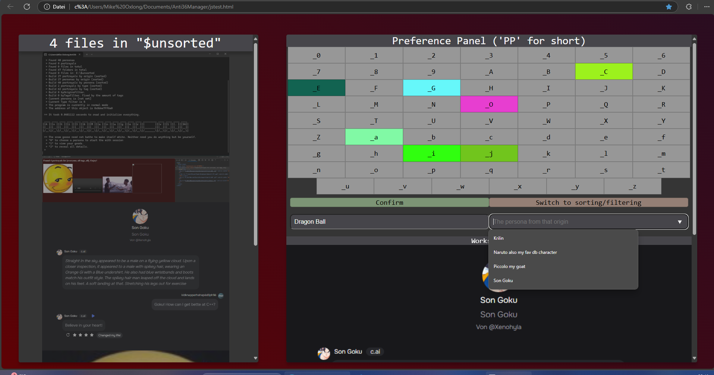
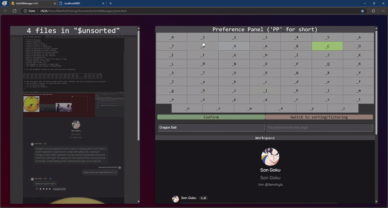

# Anti36Manager 🦴 (YO READ THIS FR!)
THERE IS A BUG. IT AINT GONNA DELETE YOUR STUFF BUT MIGHT MOVE YOUR STUFF IN UNPREDICTABLE WAYS. I'm going to fix this next commit today around 16 or 17 berlin time
Useless solution to sort and manage yer favorite "appropriate" pictures/videos. Sorted by origins, personas, tags and media types.

#### Reworked UI (Experimental)

#### Outdated

(I randomly picked some images from my computer)

#
### What is this? 
Overall it's a turbo-lightweight console based program which helps you store images/videos in a structured way. The main feature though is to give you the option to bundle everything and have them displayed to you.

<i>I'm a little backwards. What do you mean?</i> 🤨

It's like a gallery but with more of steps and more control. If you are still confused, just execute the program and you'll see what I mean.

<i>Wait, why doesn't it have a/an proper UI?</i> <b>🤨🤨🤨</b>

Not anymore. Rather than dealing with bloated UI frameworks like Qt, I’m keeping it simple with JavaScript on a localhost. It’s faster thanks to browser optimizations, way easier to work with, and super portable. No need to mess with dynamic libraries or extra dependencies.

#
### I want to contribute! 🫦🫂
Check the [CONTRIBUTING.md](CONTRIBUTING.md) file for more information.

#
### Important note 🧑‍🦼
Obviously this readme is subject to change. As this project matures, the readme will be more detailed, secure and pleasing to read. I apologize for the current situation of the repository.

#
### How to use 🤺
#### Setup 🧦
    - Have windows
    - Have a disk called E:\
        - Like an USB or a virtual disk
            - I've been using a virtual disk using windows's disk management tool

    - Create a folder called "Anti36Local" in E:\
        - Create some folders in "Anti36Local" named after some origins like games, movies, topics, etc.
        - In each origin folder, create folders named after people, places or things that are related to the origin.
            - You can always add more folders later on.
        - Check the folder path for the unsorted folder in the program and make sure it's there.

    - Have/download the g++ compiler
        - Compile the program (in c++20 or above)

    - Check everything. I only had my own computer to test this program.
        - If you encounter any bugs, **PLEASE** let me know.

#### Instructions 🎣
- Scurry through the internet to find some portrayals
- Put them into the specified unsorted folder
- Run the program
- [Read the console](https://www.youtube.com/watch?v=QQbBzOvPBpc)

#### Folder structure 📂
This is how the program expects the folder structure to be.

    Anti36Local(1)->(n)Origin(1)->(n)Persona(1)->(n)Portrayal->(n)tag

    E:/
    ├── Anti36Local/
    │   ├── topic/
    │   │   ├── object/
    │   │   │   ├── index_tags_.extension
    │   │   │   ├── index_tags_.extension
    │   │   │   ├── index_tags_.extension
    │   │   ├── object/
    │   │   │   ├── index_tags_.extension
    │   │   │   ├── index_tags_.extension
    │   ├── topic/
    │   │   ├── object/
    │   │   │   ├── index_tags_.extension
    ... ... ... ...

    Anywhere
    ├── $unsorted/
    │   ├── filename.extension
    │   ├── filename.extension
    │   ...
    ├── ui.html
    ...

#
### Troubleshooting 🤓👆🏽
It's pretty difficult to accidentally crash the program. But if you do, here are some common issues and solutions.

<i>The window shows up and closes immediately</i>

    Open cmd, input the path to the exe and run it from there to see the error message
    

    
<i>There is no error message</i>

        Impressive. Make an issue on this repository and I'll fix it. Keep the executable though. I might need it.
    

<i>It says some dll is missing</i>

    <b>WHAT?!</b> Don't forget to use "-static" when compiling the program.

<i>Known bugs</i>

    There are some bugs that I'm aware of but they don't happen unless you are trying to break the program.

#
### Other things

<i>The lore behind all this 🧓🏽📖👆🏽</i>

_Believe it or not, this program wasn’t originally meant to handle anything questionable. But at some point, people started joking that it was so I figured, why not make it real?_

_Here is my inspiration for this project:_

<i>Why did the Anti36Manager repo start at version 1.4?</i>

This project had been in development for a while, but I only recently realized I needed a second opinion on my code. So, I decided to make it public. That’s also why the README isn’t great. As much as I hate to admit it, I’m still learning to navigate software development beyond my own bubble.

