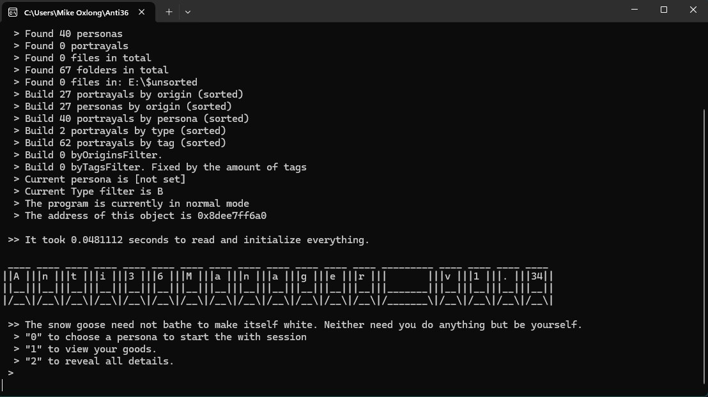
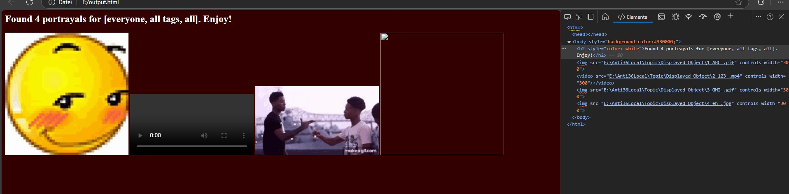

# Anti36Manager 🦴
Useless program to sort and manage your favorite "appropriate" pictures/videos. Sorted by origins, personas, tags and media types.

(I randomly picked some images from my computer)

#
### What is this? 
Overall it's a turbo-lightweight console based program which helps you store images/videos in a structured way. The main feature though is to give you the option to bundle everything and have them displayed to you.

<i>I'm a little backwards. What do you mean?</i> 🤨

It's like a gallery but with more of steps and more control. If you are still confused, just execute the program and you'll see what I mean.

<i>Wait, why doesn't it have a/an proper UI?</i> <b>🤨🤨🤨</b>

Time/effort to benefit ratio. I'm not a UI designer nor do I have the time to learn how to make a proper UI. I'm just a weirdo who wants to make a program that works. If you want to make a UI for this program, go ahead. I'll be happy to see it... Like really happy... 

#
### I want to contribute! 🫦🫂
Check the [CONTRIBUTING.md](CONTRIBUTING.md) file for more information.

#
### Important note 🧑‍🦼
Obviously this readme is subject to change. As this project matures, the readme will be more detailed, secure and pleasing to read. I apologize for the current situation of the repository.

#
### How to use 🤺
#### Setup 🧦
    - Have windows
    - Have a disk called E:\
        - Like an USB or a virtual disk
            - I've been using a virtual disk using windows's disk management tool

    - Create a folder called "Anti36Local" in E:\
        - Create some folders in "Anti36Local" named after some origins like games, movies, topics, etc.
        - In each origin folder, create folders named after people, places or things that are related to the origin.
            - You can always add more folders later on.
        - Check the folder path for the unsorted folder in the program and make sure it's there.

    - Have/download any c++ compiler
        - Compile the program (in c++20 or above)

    - Check everything. I only had my own computer to test this program.
        - If you encounter any bugs, **PLEASE** let me know.

#### Instructions 🎣
- Scurry through the internet to find some portrayals
- Put them into the specified unsorted folder
- Run the program
- [Read the console](https://www.youtube.com/watch?v=QQbBzOvPBpc)

#### Folder structure 📂
This is how the program expects the folder structure to be.

    E:/
    ├── Anti36Local/
    │   ├── topic/
    │   │   ├── object/
    │   │   │   ├── index_tags_.extension
    │   │   │   ├── index_tags_.extension
    │   │   │   ├── index_tags_.extension
    │   │   ├── object/
    │   │   │   ├── index_tags_.extension
    │   │   │   ├── index_tags_.extension
    │   ├── topic/
    │   │   ├── object/
    │   │   │   ├── index_tags_.extension
    ... ... ... ...

    Anywhere
    ├── $unsorted/
    │   ├── filename.extension
    │   ├── filename.extension
    │   ...
    ├── output.html
    ...

#
### Troubleshooting 🤓👆🏽
It's pretty difficult to accidentally crash the program. But if you do, here are some common issues and solutions.

<i>The window shows up and closes immediately</i>

    Open cmd, input the path to the program and run it from there to see the error message
    

    
<i>There is no error message</i>

        Impressive. Make an issue on this repository and I'll fix it. Keep the executable though. I might need it.
    

####

<i>It says some dll is missing</i>

    <b>WHAT?!</b> Don't forget to use "-static" when compiling the program.

####

<i>Known bugs</i>

    There are some bugs that I'm aware of but they don't happen unless you are trying to break the program.
    <ul>
        <li>Using non-ascii characters in any part of the program or Anti36Local folders. std::filesystem::path string supports characters larger than ascii but the joat::VirtualPath object (to which the fs::path is converted to) doesn't.
        <li>Deleting files/folders while the program is running. The program doesn't check if the file/folder exists before trying to access it.
        <ul>
            <li>If you want to make a change to the Anti36Local folders, go to the main menu and press enter.
        </ul>
        <li>Adding another portrayal (using the sorting option) while the selected persona is already at full capacity, meaning last index is higher than index_t can hold, the number will be set to 0 and counted up from there. This obviously leads to unexpected behavior.
        

#
### Other things

<i>The lore behind all this 🧓🏽📖👆🏽</i>

_Believe it or not, the real goal for this program wasn't to manage inappropriate things but later on, some folks made fun of my code thinking it was to manage inappropriate things. So I decided to make it a reality._

_Here is my inspiration for this project:_

<i>Why did the Anti36Manager repo start at version 1.4?</i>

This project was going on for a while but only now, I realized that I need to get a second opinion on my code. So I decided to make it public. This is the reason why the readme looks so bad. Even though I hate to admit it, I'm still in the process of understanding software development outside of my own bubble.

